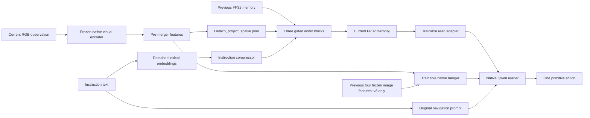

# v2/v3 recurrent navigation implementation report

Date: 2026-09-18. Implementation commit: `dad84dc77aaeee3d82970e13877514e89fc61ce9` on `recurrent_memory`, based on the v0/v1 corrections on main at `7a76695`. This report and its evidence are committed separately from the implementation. Final selected settings and measured training-time estimates are in §12.

The implemented policy uses an external observation-conditioned writer, 64 recurrent slots, and native Qwen3.5 image representations. v2 gives the reader memory plus the current image. v3 adds up to four immediately preceding native images. Both use eight-observation truncated backpropagation through time (TBPTT), an exact gradient bridge to release reader graphs between microbatches, and native PyTorch optimizer-state sharding with explicit global gradient normalization.

This is an implementation and validation report. It does not report a completed training epoch, navigation improvement, simulator results, or a completed Hugging Face upload.

## 1. Specification, scope, and provenance

The architecture comes from [the master plan](../plans/00_MASTER_PLAN.md), [v2](../plans/03_v2_memory_only.md), [v3](../plans/04_v3_memory_sw4.md), and [shared contracts](../plans/09_SHARED_CONTRACTS.md). The more concrete [implementation plan](../implementations/v2_memory_only_implementation.md) resolves the instruction compressor, live-main differences, comparison budget, precision, and hardware gates.

The implemented common settings are:

| Item | Value or behavior |
|---|---|
| Base model | Public `Qwen/Qwen3.5-4B` |
| Immutable base revision | `851bf6e806efd8d0a36b00ddf55e13ccb7b8cd0a` |
| Dataset | R2R only, complete audited episodes |
| Memory | 64 slots × 512 channels, three independent blocks |
| Writer attention/FFN | Eight heads, FFN 2048, GELU, dropout zero |
| Instruction representation | Eight learned query states after one bidirectional text block |
| Temporal horizon | At most eight observations per live segment |
| Update objective | Mean navigation loss over actual labeled states |
| Requested global budget | 64 labeled states per optimizer update |
| v2 reader images | Current image only |
| v3 reader images | Four previous images plus current, or fewer near episode start |
| Trainable parameters | Language/output parameters, native visual merger, new memory modules |
| Frozen parameters | Visual backbone before its merger |
| Precision | FP32 trainable parameters, gradients, Adam moments, and recurrent state; BF16 autocast for supported compute |
| Attention | FlashAttention 2 with deterministic backward enabled |
| Native image bounds | 12,544–451,584 pixels |
| Sequence policy | Limit 12,800 tokens; overflow rejected rather than cropping targets |

The 64-label budget supersedes the original plans' 32. Each condition initializes independently from the public base, rather than inheriting a trained v0/v1 policy. No teacher, geometry head, action chunking, previous-action features, retrieval bank, packed examples, or recurrence through Qwen hidden states is introduced.

[Model provenance](../implementations/model_manifest.json) records base artifact hashes. [The reference lock](../implementations/recurrent_reference_lock.json) records Transformers 5.3.0, installed Qwen source SHA256, and external repository revisions. The environment used for validation is `/home/an221229/code/SpatialForcing-VLN/.venv`, with Python 3.12.13 and PyTorch 2.10.0+cu129; neither reference repository's environment is installed as a policy dependency.

Execution deliberately brings forward three limited ideas from the later v4
efficiency plan: the leaf-gradient bridge, reuse of immutable frozen visual
features, and reader microbatching inside a live segment. Native optimizer-state
sharding is also used. This responds to the requested practical four H100 speed
and memory constraints. The direct sequential reference remains available;
gradient parity, reset/detach semantics, and the global objective are checked
before selecting the faster path. This is not a claim that the entire v4 plan
has been implemented. Geometry, packing, auxiliary losses, and changes to the
reader's native image representation remain outside this work.

The earlier v0/v1 IID DeepSpeed engine and this FP32 temporal backend have
different execution and numerical recipes. The two no-memory chronological
controls explicitly match the recurrent backend, precision, budget, reader
batch selection, and image protocol. A comparison against an IID baseline alone
would not isolate the effect of memory.

## 2. Architecture and update equations

Let `M[t-1]` be the previous memory, `C[t]` the pooled frozen-feature representation of the current observation, and `U[I]` the compressed instruction. The writer computes:

```text
M[t] = writer(M[t-1], C[t], U[I])
reader[t] = Qwen(original instruction prompt, adapted M[t], selected native images)
```

Only the current observation enters this writer invocation. The post-observation memory is supplied to the reader for the same decision. The reader's hidden states and generated action tokens never become writer input.



The outgoing memory becomes the next observation's incoming state. Its gradient
is retained inside the live K8 segment and detached at the segment boundary;
the forward value is preserved. The recent-image reader path never writes old
observations into memory a second time.

### 2.1 Writer-only visual representation

Qwen's official visual call returns pre-merger rows and native merger output separately. The pre-merger writer branch is detached. Its block-major rows are inverse-permuted into a raster, projected from the checkpoint's visual width to 512, and adaptive-average-pooled. The current checkpoint's pre-merger width is 1024; dimensions are read from configuration rather than assumed in the adapter.

For a raster of size `(h,w)`, the pooled dimensions are:

```text
h2 = min(h, max(1, round(8*h/max(h,w))))
w2 = min(w, max(1, round(8*w/max(h,w))))
```

The projection precedes pooling. The writer gets at most 64 cells, and neither dimension is upsampled. Each cell receives a fixed sinusoidal encoding of normalized cell-center coordinates and a learned visual type embedding. This representation is independent of the native reader tokens, which retain their original merger layout and count.

### 2.2 Instruction compressor

Only actual instruction text is tokenized, with `add_special_tokens=False`. Instructions require 1–512 lexical tokens; the full audited manifest has a measured maximum of 164. Prompt markup, action labels, paths, and source IDs do not enter the compressor.

The existing Qwen lexical embeddings are detached on this branch. A `Dtext → 512` projection and fixed 1D sinusoidal positions feed one masked, bidirectional pre-LN attention block with a residual FFN. Eight learned query slots then cross-attend to those encoded instruction tokens, followed by a pre-LN FFN residual. There is no duplicate embedding table or second text self-attention stack.

The trainer recomputes instruction features for each live segment. It does not retain their autograd graph across segments or parameter updates. Fixed-policy inference computes and retains instruction features for the active episode. Detaching the writer branch leaves the ordinary reader embedding-table path trainable.

### 2.3 Three independent gated memory blocks

Each block receives `H`, initially the previous recurrent state, and uses context `[C[t]; U[I]]`:

```text
A        = H + SA(LN_self(H))
B        = A + CA(LN_cross(A), context, context_mask)
proposal = B + FFN(LN_ffn(B))
gate     = sigmoid(W_gate [LN_gate_old(H); LN_gate_new(proposal)] + b_gate)
H_next   = H.float() + gate.float() * (proposal.float() - H.float())
```

Each attention, FFN, and gate-input normalization has its own parameters. Each of the three blocks has independent attention, FFN, and gate parameters. The learned initial parameter has shape `[64,512]` and initialization `Normal(0,0.02)`. Gate weights start at zero and gate bias at −2, producing a nonzero initial update gate.

The result is `WriterStep(state=H3, levels=(H1,H2,H3))`. Only `H3` recurs. Earlier levels belong to the same write and are not additional memory banks. The function returns new tensors, does not mutate its input state, and stores no episode cache internally.

Zero gate weights imply that gate-input normalization parameters have exactly zero gradient on the initial backward. The test explicitly records that expected initialization behavior while checking nonzero gradients through attention, FFNs, gate-linear weights, initial slots, and other producer paths.

### 2.4 Reader memory adapter

The read projection is:

```text
adapted_memory = 0.1 * Linear(Dtext)(GELU(Linear(1024)(LayerNorm(512)(M[t]))))
```

The actual implementation generalizes hidden width to `2*width` for tiny tests. Final projection weights initialize with nonzero `Normal(0,0.02)` values, allowing the initial reader loss to reach the writer. The current model's text width is 2560 and is read from the model configuration.

## 3. Code map and ownership

| Path | Implemented responsibility |
|---|---|
| `src/qwen_vl/contracts.py` | Frame/episode identity, image spans, tokenized states, visual features, writer outputs |
| `data/episode_manifest.py` | SHA256-checked complete-episode loading and canonical chronology validation |
| `data/history.py` | Current/recent/uniform chronological image selectors |
| `data/prompting.py` | Shared training/actor rendering, image and memory spans, overflow rejection |
| `data/frame_loader.py` | Bounded immutable image preprocessing with a thread pool |
| `data/episode_stream.py` | Deterministic whole-episode assignment, segment planning, exact label accounting |
| `models/qwen_adapter.py` | Native visual feature extraction and explicit reader embedding/position assembly |
| `models/navigation_policy.py` | Sole registered Qwen backbone owner, memory module composition, export/reload |
| `models/visual_tokens.py` | Merge-block inversion, projection, pooling, writer positions/type embedding |
| `models/instruction_encoder.py` | Detached lexical writer branch and eight-query instruction compressor |
| `models/memory_writer.py` | Explicit pure recurrent update and selective reset |
| `models/memory_adapter.py` | Small projection from memory width to native text width |
| `train/losses.py` | One mean CE per labeled action state |
| `train/gradient_bridge.py` | Identity-deduplicated leaf proxies and a single producer VJP backward |
| `train/distributed_grad.py` | Manual FP32 bounded-bucket synchronization and a shared finite decision |
| `train/optimizer.py` | Unique parameter groups and optional native `ZeroRedundancyOptimizer` |
| `train/episode_trainer.py` | Direct/bridged causal rollouts, segment detach, recent-feature recomputation |
| `train/run_episode.py` | Full-model chronological runner, metrics, checkpoint and export boundaries |
| `train/checkpointing.py` | Completed-update rank state, model state, manifest, RNG, and cursor restore |
| `eval/session.py` | Episode actor, idempotent observation lifecycle, fresh-cache greedy action generation |
| `eval/memory_probes.py` | Explicit labeled reset/freeze/replacement/remove-recent dependence diagnostics |
| `scripts/recurrent/` | Tiny/full parity, delayed-cue/resume diagnostics, completed-export upload helper |
| `configs/datasets/` | v2, v3, Current-only episode and Recent4 episode controls |
| `train/slurm/` | Source-snapshotted four-GPU launch wrappers |

The existing IID/SFT v0/v1 entry point remains available. `NavigationPolicy.backbone` owns Qwen exactly once; visual/reader adapters are plain helper objects rather than additional registered model owners. Optimizer grouping works from unique trainable parameter identities.

## 4. Canonical dataset and identities

The canonical manifest is `/groups/yshang/an221229/data/StageVLN-v2/episodes.jsonl`, with SHA256:

```text
243c9bf96436ee7f3a222d7b148f9ec5c5441899d9886c7699ff00ce3a693bf7
```

The preparation audit records 10,819 unique episodes and 631,244 labeled states. Actions match the original `train_gt` records. Instruction text comes from original training metadata. Observation steps within each episode are contiguous, and frame paths are relative to `/groups/yshang/an221229/data/JanusVLN_data`.

| Action | Audited count |
|---|---:|
| MOVE_FORWARD | 404,912 |
| TURN_LEFT | 111,177 |
| TURN_RIGHT | 104,336 |
| STOP | 10,819 |

The maximum audited episode length is 183 observations. Instruction lengths range from 3 to 164 lexical tokens. The episode first-frame shape audit found 640×480 images across all 10,819 first frames; this is not a claim that every image in every trajectory received a separate shape audit. [The episode summary](../implementations/episode_shape_audit.json) records instruction limits and a sampled image size; [the stress audit](../implementations/stress_data_audit.json) records dimensions for every episode’s first frame.

Semantic identity is `FrameKey(dataset, episode, step)`, not a filename position in a shuffled minibatch. A frame record separately carries path, optional target, and source ID. The loader checks manifest fingerprint, duplicate episode IDs, nonempty instruction, equal frame/action lengths, relative canonical paths, contiguous filename steps, and action/filename consistency. The instruction record carries its text SHA256. Feature/spans retain the source `FrameKey` and per-image grid.

Unlabeled observations are supported: they advance memory and chronology without fabricated STOP labels or CE. The current audited training manifest has equal observation and labeled-state counts. Support for unlabeled tails is separately tested.

## 5. Native image tokens, prompt layout, and mRoPE

### 5.1 Native feature layout

For merge size `m=2`, official pre-merger rows have merge-block order. The inverse for one image is:

```python
rows.reshape(t, h//m, w//m, m, m, d) \
    .permute(0, 1, 3, 2, 4, 5) \
    .reshape(t, h, w, d)
```

Only `t=1`, positive dimensions divisible by `m`, and matching row counts are accepted. A direct `reshape(h,w,d)` would permute spatial locations incorrectly. Non-square coordinate-coded tests verify the inverse before pooling.

The visual adapter calls the official visual model once for a group of independent images. It splits pre-merger output by `t*h*w` and native merger output by `t*h*w/m²`. The pre-merger branch is detached, while native merger embeddings retain their graph. The visual call is not enclosed in whole-model `no_grad`, which would incorrectly disable merger training.

### 5.2 Prompt and target layout

The renderer preserves the original Janus user wording and the explicit Qwen3.5 non-thinking template. The memory block is inserted after the system message and before the user prompt:

```text
system message
Memory state:
[64 ordinary-text shadow placeholder positions, replaced by adapted memory]
user message with chronological native image placeholders and instruction
assistant non-thinking prefix
supervised primitive action suffix (training only)
```

Memory positions have ignored labels and text modality IDs. Image pad spans have image modality IDs. The four primitive actions remain `MOVE_FORWARD`, `TURN_LEFT`, `TURN_RIGHT`, and `STOP`.

Each image has a recorded half-open token span, grid, source key, and current/history marker. Each image span is validated individually against its actual native merger count and grid, so an equal batch total cannot hide a per-image mismatch. Memory replacement uses its recorded span rather than a global token-ID search. With memory disabled, the entire memory delimiter and span disappear.

Training and actor use the same renderer. Inference cuts the sequence at the first supervised action position, yielding the same action prefix without target text. Overlength examples raise instead of truncating action targets.

### 5.3 Explicit embeddings and positions

The reader obtains lexical embeddings from its owned backbone, replaces image spans with native merger embeddings, and replaces the memory span with the adapted memory. The replacements remain differentiable to merger/memory outputs.

Positions are computed with Qwen's official `get_rope_index` from unmodified shadow token IDs, modality IDs, attention masks, and per-image grids. The backbone receives `inputs_embeds`, explicit multimodal `position_ids`, and no pixels or simultaneous `input_ids`. Training sets `use_cache=False`; no second visual pass occurs.

The selective-logits path gathers the union of target-prediction positions across the batch. It prepends an ignored label column and appends an unused final logit position so the CE primitive performs exactly one shift. Full/selective loss and gradient equality, padding independence, and no-target rejection are covered by tests.

### 5.4 Qwen3.5/FlashAttention compatibility

The existing local registration wrapper removes three-axis multimodal `position_ids` from the generic FA2 helper after Qwen has already applied RoPE to queries and keys. Transformers 5.3 otherwise interprets those `[3,batch,sequence]` tensors as packed-sequence metadata and constructs invalid sequence lengths. The wrapper preserves native Qwen RoPE while avoiding this generic helper path; installed Transformers source is not edited.

This shape compatibility fix is separate from deterministic backward, discussed in §9.

## 6. Causal rollout, TBPTT, and v3 recent context

Every rank reconstructs the same seeded permutation of complete episodes. Whole episodes are assigned by rank stride; within each rank there is one live stream. Steps within an episode remain chronological and are never passed through the IID length sampler.

A segment ends after at most eight observations, an episode boundary, or the remaining label budget. `K` counts observations, including unlabeled ones. An episode starts with learned initial slots. A continuing segment starts from the actual preceding carried memory value. After all backward work for the segment, the outgoing value is detached; forward memory persists, but temporal gradients stop at that boundary. At episode end both memory and recent state clear.

The scheduler counts global labels before backward and supplies one common global plan, including ranks that have exhausted their streams. It preserves short segments, uneven rank loads, and tails. A globally zero-label schedule advances observations without optimizer or LR steps.

[The complete scheduling audit](../implementations/full_episode_schedule.json) records:

| Quantity | Audited value |
|---|---:|
| Episodes | 10,819 |
| Ranks | 4 |
| Consumed observations | 631,244 |
| Consumed labels | 631,244 |
| Optimizer updates | 9,864 |
| Labels in final update | 12 |
| Maximum segments on one rank in one update | 10 |
| Padding/dropped states | None in audited schedule |

The LR schedule uses the exact label-driven update count, including the final tail, with one warmup update and cosine decay. Multiple segments can accumulate parameter gradients within one optimizer update, while each segment independently truncates its carried-state graph.

For v3, reader frames at step `t` are exactly `max(0,t-4)..t`. Each old observation is written once when it is current; historical reader images are never replayed through the writer. Segment-level image prefetch/encoding can include later segment frames, but each writer invocation consumes only its current frame and each reader prompt contains only frames available by that decision.

Recent state preserves keys across segments. Frozen pre-merger features may be retained for the recent window, but native merger outputs are recomputed for the live segment with current trainable merger weights. Trainable merger graphs are not retained across updates. Resume stores memory and recent identities and can reload recent images rather than serializing model-feature graphs. This limited frozen-feature reuse is an execution choice already included in parity checks; it does not compress the Recent4 reader tokens.

## 7. Gradient bridge and global objective

### 7.1 Per-state loss

For labeled state `s` with `n[s]` supervised target tokens, the objective is:

```text
L[s] = sum(token CE for state s) / n[s]
L_update = sum(L[s] for all real labeled states globally) / N_global
```

The target-token CE uses FP32 logits. The averaging unit is an action state, so different primitive-action token counts do not change that state's weight. Unlabeled states never invoke this CE primitive.

### 7.2 Releasing reader graphs without truncating producer gradients

The direct reference retains reader losses for the live segment and backpropagates their sum. The bridge path instead creates detached leaf proxies for differentiable producer outputs consumed by readers: native merger embeddings and adapted post-write memories. Each reader microbatch backpropagates immediately, allowing its large reader graph to be released. Reader gradients accumulate on the proxies and ordinary Qwen parameters.

After the final reader microbatch, one `torch.autograd.backward` applies all accumulated proxy gradients to the original producer outputs. This is a vector–Jacobian product through the retained small producer graph, including its eight-observation recurrent chain.

```text
dL/dtheta_producer = sum_j (d output_j/dtheta_producer)^T * proxy_grad_j
```

Outputs are deduplicated by tensor identity. Repeated reader consumption accumulates on one proxy, and ancestor/descendant producer outputs participate in one backward invocation so their chain-rule contributions add correctly. An unused differentiable output receives no artificial gradient. The bridge does not recompute stochastic readers, step parameters, or detach the temporal producer chain internally.

Unit tests cover shared outputs, repeated consumption, and ancestor/descendant outputs. The tiny actual-Qwen K8 check compares every corresponding parameter gradient, including matching `None` states, for R0 and R4. An additional [batch 8 K8 check](../implementations/temporal_parity_b8.json) passes for both R0/R4, with maximum all-parameter gradient difference `1.7881393432617188e-07`. Full-checkpoint evidence is a separate selected-gradient K2 check rather than an all-parameter K8 proof.

### 7.3 Manual distributed normalization

A rank's segment loss is multiplied by `world_size/N_global`. After all its segments, a single explicit synchronization computes gradient SUM and divides by `world_size`:

```text
(1/world_size) * sum_r [(world_size/N_global) * local_gradient_sum_r]
= global_gradient_sum / N_global
```

No DDP or DeepSpeed gradient hooks run in this episode engine. Parameters are traversed in common deterministic order. An active-gradient mask is globally reduced before bounded-size FP32 gradient buckets:

- Globally inactive parameters retain `grad=None`.
- Locally absent but globally active gradients become zero contributions.
- Large parameters are split across communication buckets.
- Idle ranks join the same collectives.

All ranks share a finite-gradient decision. Clipping occurs once after synchronization, followed by one optimizer step and one LR step. Two-rank CPU/gloo tests compare unequal local label counts and idle/unused branches against a single-process global reference.

### 7.4 Native optimizer-state sharding

`ZeroRedundancyOptimizer` wraps AdamW when sharding is requested and the process group has more than one rank. It shards optimizer state while trainable parameters and synchronized gradients remain replicated. This preserves manual gradient synchronization and FP32 Adam moments. CUDA AdamW uses its fused implementation.

Parameter groups separate language/output (`1e-6`), native merger (`1e-5`), and new modules (`1e-4`). Biases and normalization parameters are excluded from weight decay 0.01. Trainable parameter identities are unique.

A two-rank sharded checkpoint/resume test covers local optimizer shards and update continuation. This is native PyTorch optimizer-state sharding, not an assertion that the episode engine uses the earlier SFT DeepSpeed engine.

## 8. Precision and storage accounting

Frozen visual backbone parameters are BF16. Its trainable native merger is restored to FP32; language/output and newly initialized modules remain FP32. The runner asserts that all trainable parameters are FP32. It also asserts FP32 local Adam `exp_avg` and `exp_avg_sq` after the first optimizer update.

BF16 autocast applies to supported CUDA matrix operations. Writer attention/FFN/gate results are converted to FP32 for the recurrent residual equation. Initial, carried, reset, and checkpointed memory values remain FP32. Attention compute can therefore be BF16 without accumulating the recurrent residual in BF16.

CPU module tests run the combined projector/compressor/writer/adapter under BF16 autocast and verify FP32 recurrent state, finite forward/backward, and FP32 trainable parameters. Full-model checks run the checkpoint with FP32 trainable parameters and BF16/FA2 compute. These checks do not claim that every internal activation is FP32 or that arbitrary BF16 and FP32 runs have bitwise-identical gradients.

For `P` trainable elements, replicated parameter/gradient/two-moment storage alone is roughly `16*P` bytes before activations, frozen weights, buckets, temporary workspaces, and allocator reserve. Optimizer sharding reduces the local moment portion, not replicated parameters or gradients. The runner writes exact `storage_rank*.json` counts after an optimizer update, and reports peak allocated/reserved CUDA memory and update time. [The measured recurrent storage record](../implementations/recurrent_storage.json) reports 4,258,544,128 unique trainable parameters. Fully replicated parameter/gradient/two-moment storage would occupy approximately 63.4573 GiB before frozen weights and activations. The actual native sharded run records:

| Rank | FP32 parameter bytes | Gradient bytes | Local Adam-moment bytes | Frozen bytes |
|---|---:|---:|---:|---:|
| 0 | 17,034,176,512 | 17,034,176,512 | 8,518,474,752 | 612,485,120 |
| 1 | 17,034,176,512 | 17,034,176,512 | 8,516,639,744 | 612,485,120 |
| 2 | 17,034,176,512 | 17,034,176,512 | 8,516,619,264 | 612,485,120 |
| 3 | 17,034,176,512 | 17,034,176,512 | 8,516,619,264 | 612,485,120 |

The local moment shards total 34,068,353,024 bytes globally, exactly the two FP32 moments for this trainable count. Small shard imbalance reflects native parameter partitioning. These are storage counts, not peak allocator measurements. Final accepted stress/headroom choices are recorded in §12; the label “4B” is not used as an exact byte count.

## 9. Deterministic FA2 investigation

The first full-checkpoint R0/R4 direct/bridge comparison had identical forward losses but differing selected gradients. [The original full temporal log](../implementations/full_temporal_parity.log) records relative L2 differences reaching roughly 6.55% for the R4 initial-slot gradient and similar magnitudes in several small producer paths. That discrepancy was investigated rather than accepted by widening tolerance.

The diagnostic added a repeated direct run to distinguish bridge behavior from run-to-run backward variation, then enabled `FLASH_ATTENTION_DETERMINISTIC=1`. Under deterministic FA2, direct, repeated-direct, and bridge paths have identical reported losses and zero maximum absolute/relative L2 difference for every selected gradient in the full-checkpoint K2 R0 and R4 check. [The deterministic evidence](../implementations/full_temporal_parity_deterministic.log) records the setting and all comparisons.

The checked tensors are native merger `linear_fc2.weight`, language layer 3 `q_proj.weight`, learned initial slots, writer block 0 self-attention projection, instruction input projection, visual input projection, and memory adapter final projection. This evidence supports nondeterministic FA2 backward as the source of the observed discrepancy in that experiment. It is not an exhaustive equality claim for every full-model parameter, K8, every reader microbatch size, or every episode.

The full no-memory adapter check was also rerun with deterministic FA2. [Its current log](../implementations/full_adapter_parity.log) records zero selected-position-logit/loss difference and zero maximum absolute/relative L2 difference for both selected merger/language gradients, for image-count pairs 1/2 and 5/9. This replaces the earlier >0.9999-gradient-cosine-only result; it remains a check of selected tensors, not an exhaustive full-model gradient comparison.

All episode configs now set `attention_deterministic=true`, and the runner sets the FA2 environment flag before loading/using attention. Final throughput selection must use this corrected setting; earlier nondeterministic timing runs remain historical measurements rather than final acceptance figures.

## 10. Checkpoints, export, and actor lifecycle

### 10.1 Completed-update resume

Checkpoint saving occurs after segment backward, global synchronization, clipping, optimizer/LR steps, and cursor advancement. Rank zero writes the policy model state once. Every rank writes its local optimizer state, wrapper group hyperparameters, LR scheduler, deterministic episode schedule, detached cursor state, and Python/NumPy/Torch/CUDA RNG state. Cursor floating tensors are detached CPU FP32.

An atomic completion manifest is published after the payloads exist. Completed checkpoint paths are immutable. Loading requires the same world size, optimizer backend, exact run manifest, and compatible episode schedule. World-size repartition is unsupported.

Restoring wrapper parameter-group hyperparameters matters for native ZeRO: its next step copies wrapper hyperparameters into the local Adam optimizer. Loading only the local shard would reset the saved LR on the next step; the implementation restores both.

The final checkpoint naming helper distinguishes a zero-label observation tail that changes cursor consumption without increasing optimizer step. Resume restores RNG last and recomputes trainable instruction/merger features rather than restoring old feature graphs.

[The tiny actual-Qwen live-episode resume test](../implementations/recurrent_resume.json) reports exact next loss/cursor agreement, maximum parameter error `1.4901161193847656e-08`, and the same maximum Adam-state error. This is a tiny FP32 R4 continuation experiment, supplemented by distributed sharded toy resume tests.

Separate actual four H100 continuations loaded the v2 and v3 full-model checkpoints at update 32 and reached update 33 with 2,112 consumed labels, finite losses `0.2548833599` (v2) and `0.2232781170` (v3), and nonzero writer gradients. [The v2 resume log](../implementations/verify_v2_resume.log) additionally records no epoch-time estimate for its single cold update. [The resume log](../implementations/verify_v3_resume.log) demonstrates restoration and the next chronological update; it does not compare that resumed full-model update against a simultaneously retained uninterrupted reference.

The run manifest includes a hash of all Python sources under `qwen_vl`, architecture, base model configuration, processor settings, package versions, and allocator configuration. Adding offline probes after the checkpoint changed the live-worktree source hash, so this continuation correctly used the run's exact `source_snapshot/src`. Production launches snapshot the source automatically. This preserves strict manifest checking rather than weakening it to resume changed code.

### 10.2 Portable policy export

The exported policy contains native Qwen safetensors and processor under `backbone/`, new-module weights in `memory.pt`, `navigation_config.json`, `prompt_protocol.json`, and a run manifest. It avoids duplicating the multi-billion-parameter backbone in the small-module export. The processor receives the same explicit non-thinking template. Export/reload tests validate ownership, module restoration, and prompt behavior. [The full export check](../implementations/recurrent_export_check.json) reloads the actual update-32 policy export in FP32 and compares all 833 saved tensor values exactly after dtype normalization (frozen visual weights are saved in BF16); the native tied input/output embedding relationship is preserved.

The same [full export check also passed for v2](../implementations/v2_export_check.json), preserving 833 saved tensor values and generating `MOVE_FORWARD`, `MOVE_FORWARD`, `TURN_RIGHT` for three observations. Both saved exports use the settings recorded with their own update 32 checkpoints; the original v3 save/reload/resume checks used reader batch 4, while the later selected batch 8 has separate training, gradient, and stress evidence.

Training checkpoints are continuation artifacts with optimizer/RNG/cursor state. Policy exports are inference artifacts. The upload helper uploads only a completed export, excluding optimizer shards.

### 10.3 Actor behavior

A `PolicySession` holds one active episode's memory, fixed-weight instruction features, recent frames/features, and previous decisions. `reset(episode_id,instruction)` establishes episode identity. `observe(step_id,rgb)` requires contiguous new steps and accepts PIL RGB, uint8 HWC arrays, relative paths, or frame records. Frame-record action/source labels do not enter actor input. Sessions may share a fixed policy sequentially; concurrent calls sharing a policy are unsupported.

Each new observation gets exactly one writer update before generation. Repeating an existing step returns its recorded decision; conflicting RGB, changed instruction for the same episode, or skipped new steps raises. A decode failure is also recorded so retrying the same observation cannot update memory twice. Native recent features may be retained while the inference policy is fixed.

Greedy action generation uses a fresh local Qwen cache per decision. The prefix is supplied as assembled embeddings with explicit three-axis RoPE; Qwen's generation convention additionally supplies sequential text positions for its masking path. For a prefix length `L` and `p=1+max(prefix_rope)`, generated token `j` is fed with `cache_position=L+j` and all three RoPE axes at `p+j`. Subsequent calls feed only the newly generated token IDs. The writer and vision model are not called inside this token loop, and no generation cache is carried to the next navigation decision.

The decoder removes tokenizer special tokens, strips surrounding whitespace, and requires exactly one of the four primitive action strings. Invalid output raises; it is not silently converted to STOP. Actor tests cover reset/isolation, R4 selection across boundaries, repeated-step behavior, generation-prefix alignment, and native generation-position behavior. The actual full exported actor produced three valid `TURN_RIGHT` decisions in the recorded observation check and passed duplicate-observation idempotence. This verifies valid decoding/lifecycle on those observations, not correctness of those navigation choices. No simulator has exercised this actor in closed-loop navigation yet.

### 10.4 Labeled memory probes

`MemoryProbe` provides explicit diagnostic protocols for reset at selected steps, freezing updates after a step, replacing state with a captured state from another already observed episode, and removing the Recent4 reader window as a labeled cross-protocol intervention. It records intervention kind/time, episode, history length, recent-frame count, and replacement source where applicable. Replacement snapshots are detached cloned FP32 states; no future observation is supplied. Default training is unaffected.

Two unit tests cover protocol behavior and invalid/future/cross-episode inputs. The full exported-policy diagnostic runs baseline plus four intervention protocols over ten observations (50 teacher-forced loss records), with the complete events and memory norms in [the export check](../implementations/recurrent_export_check.json). These are open-loop dependence diagnostics after a short smoke; they do not establish memory benefit or a causal navigation improvement.

### 10.5 Full-checkpoint sequential reference trace

[The reference trace](../implementations/recurrent_reference_trace.json) uses the actual full-model update-32 export with M64/R4/K8, FP32 trainable/state values, BF16 compute, deterministic FA2, and reader microbatch four. It consumes the complete 21-state real episode `2267` in segments 8/8/5, then resets into episode `1` for two observations: 23 observations and four segments total, with no optimizer step or weight change.

Each observation records source FrameKey, selected reader FrameKeys, image grids, prompt/target lengths, CE, selected logits, memory norm/dtype, reset status, and gate statistics. Each segment records detach status and five selected gradient norms/SHA256 checksums. Continuing segments explicitly record learned initial slots as unused (`grad=None`), while first/reset segments record their gradient. The artifact supplies the requested causal segment/reset reference for later execution comparisons; no later-v4 reproduction has yet been performed.

## 11. Reference differences and recorded verification

### 11.1 μVLA and VPWEM

The reference lock pins μVLA at `13e1cf9a34d40726c9f4eeafff464d45c25181bc` and VPWEM at `5e372e847793ced1c37d39d4efa7b2b710eb826c`. These repositories are consulted as implementation references, not imported policy dependencies. The corresponding [μVLA paper](https://arxiv.org/html/2606.12497v1) and [VPWEM paper](https://arxiv.org/html/2603.04910v1) were reviewed alongside the pinned code; architecture differences are explicit below.

μVLA provides learned-slot initialization and episode reset/TBPTT examples. Its recurrent next state is extracted from processing in the large backbone. This policy instead updates state through a separate small writer using frozen current visual features and detached lexical embeddings. It does not copy μVLA's default continuing-stream detach or EMA branch as a within-K8 gradient policy.

VPWEM provides a small self/cross-attention Q-Former organizational reference. Its internal mutable query/condition caches and detached historical queries are not used. The implemented writer receives and returns explicit state, preserving differentiability for the caller's live segment. Neither continuous-action/diffusion objectives nor reference action heads are included.

### 11.2 Evidence ledger

| Evidence | Recorded result | Scope |
|---|---|---|
| [Recurrent test suite](../implementations/recurrent_tests.log) | 49 passed, 14 dependency deprecation warnings in 31.55 s | Final CPU/unit/distributed/actor/probe suite on the implementation tree |
| [Tiny no-memory adapter](../implementations/adapter_parity.json) | Logit and selected-gradient maximum error 0 | Tiny deterministic Qwen, image-count pairs 1/2 and 5/9 |
| [Tiny temporal parity](../implementations/temporal_parity.json) | Maximum parameter-gradient difference `1.1920928955078125e-07` | Actual tiny Qwen architecture, K8, R0/R4, direct batch 1 vs bridge batch 2 |
| [Full adapter parity](../implementations/full_adapter_parity.log) | Selected-position-logit/loss and selected-gradient max/relative errors 0 | Public full checkpoint, BF16/deterministic FA2, image-count pairs 1/2 and 5/9; two selected native merger/language tensors |
| [Deterministic full temporal parity](../implementations/full_temporal_parity_deterministic.log) | Direct/repeat/bridge losses agree; all selected gradient max errors 0 | Full checkpoint, BF16/deterministic FA2, K2, R0/R4, seven selected parameter tensors |
| [Live-episode resume](../implementations/recurrent_resume.json) | Next loss and cursor agree; maximum parameter/Adam errors `1.49e-08` | Tiny actual Qwen, FP32, R4 |
| [Delayed cue toy](../implementations/delayed_cue.json) | Loss `1.419281 → 0.001832`; accuracy 1.0 after 200 updates | Synthetic cue only at write0, supervision only at write7, no within-K8 detach |
| [Full schedule audit](../implementations/full_episode_schedule.json) | 631,244 labels consumed once; 9,864 updates; final 12 labels | Four-rank deterministic plan, complete canonical manifest |
| [Episode/instruction audit](../implementations/episode_shape_audit.json), [stress audit](../implementations/stress_data_audit.json) | 10,819 episodes; instruction max 164; all episode first frames 640×480 | First-frame audit, not all-frame image-shape enumeration |
| [Real-episode overfit](../implementations/real_episode_overfit.json) | 18 complete passes; loss `12.407435 → 6.100478`; finite gradients and nonzero initial gradient in all three writer blocks | Tiny randomly initialized model, real 21-state episode 2267, reduced diagnostic-only image resolution, toy optimizer settings |
| [Full-model sequential trace](../implementations/recurrent_reference_trace.json) | 23 observations, segments 8/8/5/2, per-step gates/grids/prompt lengths/loss/logits, five selected gradient checksums | Actual update-32 full export, M64/R4/K8, reset and continuation boundaries, fixed weights |
| [Full export/actor/probes](../implementations/recurrent_export_check.json) | All 833 saved tensors exact; tying preserved; three valid actions; duplicate idempotence; 50 probe-loss records | Actual update-32 export reloaded in FP32; values compared after dtype normalization; open-loop actor/dependence checks |
| [Four-H100 v3 run](../implementations/verify_v3_recurrent.log) | 32 updates/2,048 labels, finite losses, update-32 checkpoint/export saved | Deterministic FA2, bridge, reader batch 4, gradient checkpointing; bounded smoke, not a full epoch |
| [Four-H100 resume](../implementations/verify_v3_resume.log) | Restored checkpoint 32 and reached update 33, 2,112 labels, finite loss `0.223278` | Exact source snapshot and strict run manifest; no full-model uninterrupted-reference equality claim |
| [Recurrent storage](../implementations/recurrent_storage.json) | 4,258,544,128 trainable elements; exact per-rank parameter/gradient/Adam counts | Four-rank native optimizer-state-sharded full-model run |
| [Final v2 stress](../implementations/stress_v2_final_b4.log), [final v3 stress](../implementations/stress_v3_final_b8.log) | Each consumes1,165 labels in 19 updates with a13-label tail; finite losses/gradients | Selected production reader batches4/8, GC off/on; deterministic attention and expandable allocator |

The 100% accuracy above belongs only to the synthetic delayed-cue task. It demonstrates trainable temporal credit in a deliberately controlled example; it is not a navigation accuracy or SR/SPL result. The completed real-episode diagnostic separately passes its predeclared criterion: at least eight complete episode passes, final loss at most half the initial loss, finite gradients, nonzero initial writer-block gradients, and exact writer/observation counts. It takes 18 passes over the whole 21-state episode, producing 378 writes/observations/labels. Loss falls from `12.4074350539` to `6.1004776501`; every pass preserves 8/8/5 chronology. This uses a tiny random model and toy hyperparameters with deliberately reduced native image resolution, below production pixel bounds. The episode is dominated by MOVE_FORWARD; the result is not evidence of useful navigation memory or production-model convergence.

Finite real-image smoke losses validate execution, not navigation quality.

The older [verification summary](../implementations/verification_results.json) describes v0/v1 work and predates recurrent completion. Its “unrun v2/v3” field is historical; recurrent evidence is the ledger above and [the recurrent verification record](../implementations/recurrent_verification.json).

## 12. Final training settings, time estimates, and launch artifacts

### 12.1 Selected production configuration

| Setting | v2 Memory64/current | v3 Memory64/Recent4/current |
|---|---:|---:|
| Dataset config | `configs/datasets/v2_mem64_r0.json` | `configs/datasets/v3_mem64_r4.json` |
| Reader microbatch per GPU | 4 | 8 |
| Live temporal segment | K8 observations | K8 observations |
| Global labeled-state budget | 64 | 64 |
| Non-reentrant activation checkpointing | Off | On |
| Execution | Exact leaf-gradient bridge | Exact leaf-gradient bridge |
| Optimizer-state sharding | Native PyTorch ZeRO/AdamW | Native PyTorch ZeRO/AdamW |
| Attention | Deterministic FA2 | Deterministic FA2 |
| CUDA allocator | `expandable_segments:True` | `expandable_segments:True` |
| Epochs / seed | 1 / 42 | 1 / 42 |
| Slurm GPUs / CPUs / host memory | 4 H100 80GB / 8 / 192GB | 4 H100 80GB / 8 / 192GB |
| Prepared walltime | 12 hours | 16 hours |
| Checkpoint interval | 2,500 optimizer updates | 2,500 optimizer updates |

Both configs use the audited full R2R manifest and retain M64/width512/three
blocks. The no-memory controls `v1_current_ep.json` and `v1_sw4_ep.json` mirror
the corresponding reader batch 4/8, image selection, precision, scheduler,
optimizer backend, and checkpointing choice without allocating writer modules
or inserting memory tokens. They are distinct from the original IID v0/v1 SFT
conditions.

Global64 counts actual labeled action states, not episodes or fixed accumulation
slots. In ordinary full segments, v2 executes two reader batches of 4 per K8
segment and v3 executes one batch of 8. Two such segments per rank across four
ranks yield 64 labels. Short episodes and the final tail change this decomposition;
the scheduler/reducer use the actual global count, and the audited final update
has 12 labels. There is no padded recurrent observation or extra division by a
nominal accumulation count.

### 12.2 Four-H100 throughput and expected full training time

The selected-config measurements use32 updates/2,048 labels from the same first
64 complete episodes. They run in the existing interactive allocation826441 on
`evc102`. No new Slurm job was submitted. The subset's own cosine schedule is
used, so smoke loss is not a claimed prefix of the full-epoch learning curve.

| Condition | Mean seconds per 64-label update | Labeled states/s | Estimated compute for 9,864 updates | Practical training allowance |
|---|---:|---:|---:|---:|
| v2, batch 4, GC off | 2.1600 | 29.63 | 5.92 h | About6–8 h |
| v3, batch 8, GC on | 3.4423 | 18.59 | 9.43 h | About10–13 h |

The calculation is `mean_update_seconds * ceil(631244/64) / 3600`. Means exclude
the first two full updates; short tail updates are excluded. Timing is the
maximum elapsed time across the four ranks. The estimate does not count model
startup, checkpoint/export I/O, upload, or queue time. The practical allowance
adds room for saving and variable filesystem/compute throughput; it is not a
guarantee. The full dataset's episode-length imbalance and cluster contention
can change the result. Prepared walltime limits leave additional margin.

[The v2 run](../implementations/verify_v2_recurrent.log) has loss
`0.936159 → 0.217966`, with first-four/last-four update mean loss
`0.718826 → 0.243951`. [The selected v3 batch 8 run](../implementations/verify_v3_b8_deterministic.log)
has loss `1.387344 → 0.195306`. All recorded losses and gradient norms are finite,
and writer block0 receives nonzero gradient in every measured update. Each run
contains different states across updates, so the decrease is an execution and
learning sanity check, not a controlled navigation-quality comparison.

The matched chronological controls also each completed 32 updates/2,048 labels
with finite, decreasing first-four/last-four mean loss. Current-only_ep at batch 4
measured 1.4610 s/update (4.00 h extrapolated); Recent4_ep at the final batch 8
measured 3.2867 s/update (9.01 h extrapolated). Their logs are
[current-only](../implementations/verify_v1_current_ep.log) and
[Recent4 batch 8](../implementations/verify_v1_sw4_ep_b8.log). These are bounded
matched-backend checks, not completed comparative experiments or the original
IID v0/v1 timing estimates.

The earlier deterministic v3 batch 4 run measured 3.6574 s/update, or10.02 h. Batch8
was about 5.9% faster in the same bounded comparison, using approximately2.4 GiB
more peak allocated memory. A deterministic v3 batch 1/no-checkpointing run was
slower and used more allocated memory. v2 batch 4 without checkpointing was
chosen after smaller/checkpointed candidates and the long-instruction stress
checks. These are measured practical choices, not an exhaustive proof of the
fastest possible hardware/software configuration. Historical nondeterministic
or short/compilation-affected candidate logs are retained as such and are not
used as the final throughput estimates.

The primary v2 smoke peaked at 65.500 GiB allocated/67.490 GiB reserved. The chosen
v3 batch 8 smoke peaked at 53.406/58.426 GiB. The original saved v3 batch 4 smoke
peaked at 50.995/57.033 GiB. All figures are maximum reported CUDA peaks across
ranks, not merely rank0.

### 12.3 Long-instruction stress and memory headroom

The stress subset contains the 16 longest-instruction episodes,1,165 states total,
and a pinned manifest SHA recorded in [the stress audit](../implementations/stress_data_audit.json).
Each final stress run finishes all 19 updates, including the 13-label tail, with
finite loss/gradients and nonzero writer gradients. No sequence truncation,
resolution reduction, or shorter temporal horizon is used.

| Selected condition | Peak allocated GiB | Peak reserved GiB | Result |
|---|---:|---:|---|
| v2 batch 4, GC off, expandable allocator | 67.983 | 69.455 | Passed |
| v3 batch 8, GC on, expandable allocator | 53.661 | 58.988 | Passed |

The device reports81,559 MiB, about 79.65 GiB. Thus roughly10.2/20.7 GiB lies
outside the reported peak PyTorch reservations in these v2/v3 stress runs;
CUDA/NCCL and other process allocations also consume device memory. This is
measured headroom for the audited workload, not a universal allocation guarantee.
The native processor still supports variable image grids and validates each span.
The first frame of every episode was640×480; all 631,244 image headers were not
individually shape-enumerated.

### 12.4 Checkpoint/export locations and reproducible commands

Saved update 32 runs are:

- `/groups/yshang/an221229/checkpoints/StageVLN-v2/verify_v2_recurrent/`
- `/groups/yshang/an221229/checkpoints/StageVLN-v2/verify_v3_recurrent/`

Each contains `checkpoint-32/`, `export/`, a run manifest, metrics, exact source
snapshot, and `SMOKE_COMPLETE`. Each checkpoint occupies about 49 GiB and each
export about 17 GiB. Four retained full-run checkpoints plus an export therefore
need roughly213 GiB per condition, subject to filesystem accounting. No training
weights or optimizer shards are committed to GitHub.

Both checkpoints resumed to update 33 on four GPUs. Both exports passed the full
saved-value comparison and actor/probe checks. The saved v3 checkpoint used
reader batch 4; the final batch 8 choice has separate32-update training, tiny K8
all-gradient parity, and full long-instruction stress evidence. The reference
trace also intentionally stays tied to the fixed batch 4 export/config.

[Validation commands](validation_commands.md) give the exact environment,
bounded launch arguments, resume procedure, and diagnostics. [The machine-readable
performance record](../implementations/recurrent_performance.json) records the
actual runtime microbatch/precision/allocator metadata rather than inferring
historical settings from a subsequently edited config. Use a fresh output
directory and the original source/config snapshot for strict resume.

The prepared wrappers are `train/slurm/v2_r2r.slurm` and `v3_r2r.slurm`. Launch
from the `recurrent_memory` checkout root, with `slurm_logs/` present. They copy
`src`, `configs`, `train`, and `scripts` into each run's source snapshot, record
Git revision/source changes and the base model manifest, and run `torchrun`
against the snapshot. Checkpoints/exports remain under
`/groups/yshang/an221229/checkpoints/StageVLN-v2/`.

Torch/OMP/MKL/OpenBLAS use one CPU thread per process, tokenizer parallelism is
disabled, and preprocessing uses one worker per GPU with a bounded cache.
No episode/model state is delegated to preprocessing workers.

### 12.5 Publication and acceptance

The completed-export helper requires `TRAINING_COMPLETE` and complete native
weights plus memory/config/protocol artifacts. It uploads only the final policy
export to private `anhdao69/StageVLN-v2_mem64_r0-r2r` or
`anhdao69/StageVLN-v3_mem64_r4-r2r`, after successful full training. Authentication
is read from the external user cache and never enters committed source or run
artifacts. The smoke-export rejection guard was executed and passed before any
Hugging Face API call. No actual Hugging Face upload has been performed.

Implementation commit `dad84dc` contains the source/config/diagnostic changes;
the baseline model/trainer source was validated at `7a76695`. Main now includes the v0 walltime-only follow-up `c340227` (24→28 hours). The final suite is 49 passed,14 dependency deprecation
warnings,31.55 seconds. Shell syntax, Python compilation, diff whitespace, local
report links, and credential-shaped-string scans were also checked. See the
separate [acceptance record](acceptance.md) for the distinction between tested
architecture, tiny overfit, full-model execution, and unrun closed-loop quality.

For the earlier v0/v1 question, the longer paired timing runs estimate about 22 h for v0 and 9 h for v1. [The timing report](training_time_estimates.md) records all four versions, raw runtimes, subset hashes, and the distinction between IID baselines and matched chronological controls.

## 13. Limits and remaining empirical gates

The evidence establishes tested layout, gradient-routing, temporal-boundary, distributed-normalization, checkpoint, and actor properties in defined cases. It does not establish universal correctness, useful long-horizon navigation memory, or generalization to unseen environments.

Outstanding or narrower-than-original-plan gates include:

- A completed epoch for each primary condition and matched chronological controls.
- Production-model convergence and broader memory reset/shuffle sensitivity assessment. The real-episode tiny-model overfit and full-export reset/freeze/replacement/remove-recent dependence checks are completed, but are not navigation-benefit evidence.
- Simulator SR/SPL/NE/OS and closed-loop actor evaluation.
- Later-v4 reproduction of the now-recorded full-model M64/R4/K8 sequential trace. The probe API and trace artifact themselves are completed.
- Any K16 memory-learning diagnostic required before a strong long-memory conclusion.
- Actual completed export publication to Hugging Face.

Architecture, temporal correctness evidence, synthetic learning evidence, hardware execution measurements, and navigation quality are kept separate in this report. Final status must be based on the corresponding verified artifact rather than inferred from a finite smoke loss.
